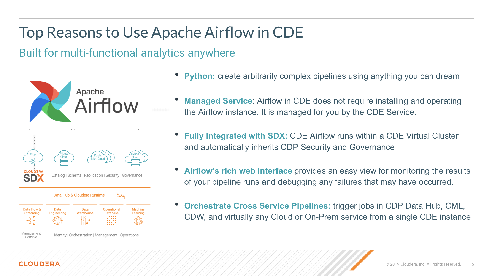
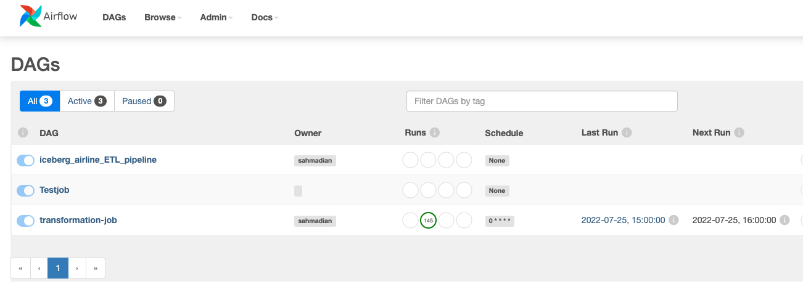
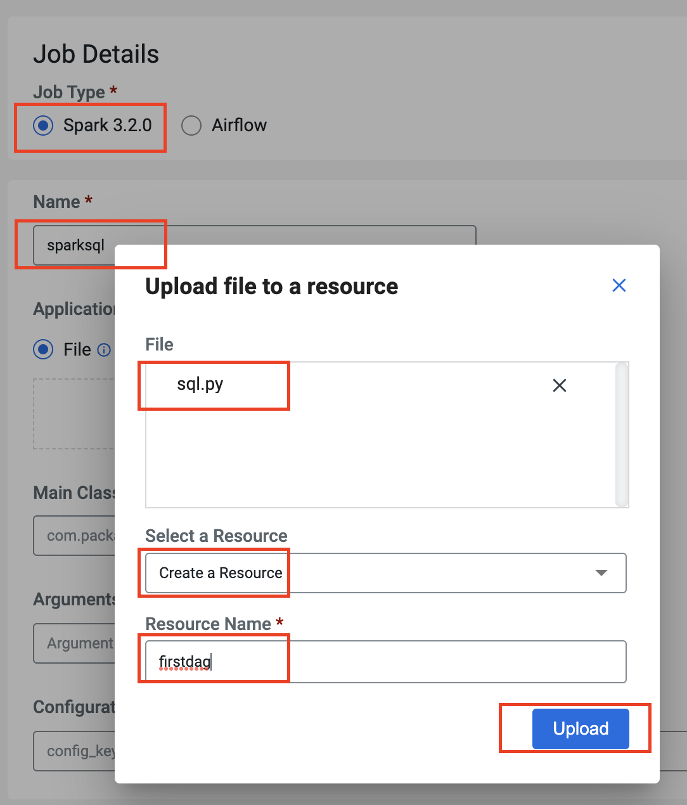
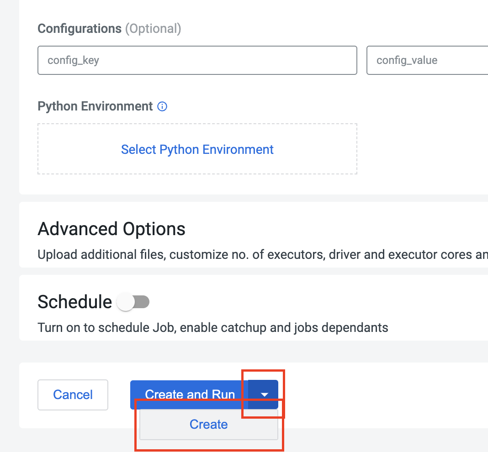

# Using CDE Airflow

## NB: This project is WIP 

## Objective

This tutorial provides a reference of Airflow features and capabilities in CDE, the Cloudera Data Enginereering Service available in CDP Public and Private Cloud. 

Apache Airflow is a platform to author, schedule and execute Data Engineering pipelines. It is widely used by the community to create dynamic and robust workflows for batch Data Engineering use cases. 

CDE embeds Apache Airflow at the CDE Virtual Cluster level. It is automatically deployed for the CDE user during CDE Virtual Cluster creation and requires no maintenance on the part of the CDE Admin.




## Requirements

In order to follow the steps you need:
* A CDE Virtual Cluster either in CDP Public or Private Cloud.
* Recommended: familiarity with the Python Programming Language.
* Recommended: knowledge of the CDE CLI. If this is new, you can complete [this introduction](https://github.com/pdefusco/CDE_CLI_Simple) or [this advanced guide](https://github.com/pdefusco/CDE_CLI_demo).
* Optional: a CDW Virtual Cluster. This will be required by the steps covering the Airflow CDW Operator to run Impala and Hive queries.


## Project Contents

1. Airflow Concepts
2. Getting Started with Airflow in CDE
3. Beyond Airflow for Spark Jobs
4. Airflow DAG Advanced Features
5. Airflow Job Management with the CDE API and CLI
6. CDE Airflow FAQs


## 1. Airflow Concepts

#### The Airflow DAG

In Airflow, a DAG (Directed Acyclic Graph) is defined in a Python script, which represents the DAGs structure (tasks and their dependencies) as code.

For example, a simple DAG could consist of three tasks: A, B, and C. It could say that A has to run successfully before B can run, but C can run anytime. It could say that task A times out after 5 minutes, and B can be restarted up to 5 times in case it fails. It might also say that the workflow will run every night at 10pm, but shouldn’t start until a certain date.

For more information about Airflow DAGs reference the [Apache Airflow documentation](https://airflow.apache.org/docs/apache-airflow/stable/concepts/dags.html). 
For an example DAG in CDE reference the [CDE Cloudera documentation](https://docs.cloudera.com/data-engineering/cloud/orchestrate-workflows/topics/cde-airflow-editor.html).

#### The Airflow UI

The Airflow UI makes it easy to monitor and troubleshoot your data pipelines. For a complete overview of the Airflow UI reference the [Apache Airflow documentation](https://airflow.apache.org/docs/apache-airflow/stable/ui.html).
 
#### What is an Airflow CDE Job?

CDE Jobs can be of two types: Spark and Airflow. Airflow CDE Jobs are typically used to orchestrate Spark CDE Jobs as well as other Data Engineering actions. 

CDE Jobs of type Airflow consist primarily of an Airflow DAGs contained in a Python file. More on DAGs below.

There are three ways to build an Airflow CDE Job:

* Using the CDE Web interface. For more information, see [Running Jobs in Cloudera Data Engineering](https://docs.cloudera.com/data-engineering/cloud/manage-jobs/topics/cde-run-job.html).
* Using the CDE CLI tool. For more information, see Using the [Cloudera Data Engineering command line interface](https://docs.cloudera.com/data-engineering/cloud/cli-access/topics/cde-cli.html).
* Using CDE Rest API endpoints. For more information, see [CDE API Jobs](https://docs.cloudera.com/data-engineering/cloud/jobs-rest-api-reference/index.html)

In addition, you can automate migrations from Oozie on CDP Public Cloud Data Hub, CDP Private Cloud Base, CDH and HDP to Spark and Airflow CDE Jobs with the [oozie2cde API](https://github.com/pdefusco/Oozie2CDE_Migration). 

#### Open Source vs CDE Airflow

CDE packages the open source version of Airflow. Airflow is maintained and upgraded at each CDE version update. For example, the version of CDE 1.16 includes Airflow 2.2.5. 

CDE Airflow imposes no limitations on Operators, Plugins or other integrations with external platforms. Users are free to deploy Airflow DAGs in CDE as dictated by the use case. However, Cloudera contributed two operators to the Airflow Community: 

* CDE Operator: used to orchestrate Spark CDE Jobs. This has no requirements other than creating a Spark CDE Job separately and then referencing it within the Airflow DAG syntax.
* CDW Operator: used to orchestrate CDW Hive or Impala queries. This requires a Cloudera Virtual Warehouse and setting up an Airflow connection to it. 

For an example DAG in CDE using the two operators reference the [CDE Cloudera documentation](https://docs.cloudera.com/data-engineering/cloud/orchestrate-workflows/topics/cde-airflow-editor.html).


## 2. Getting Started with Airflow in CDE

#### Accessing the CDE Airflow UI

From your Virtual Cluster Service Details page, open the Airflow UI by clicking on the related icon as shown below.




#### Building Your Fist CDE Airflow DAG

We will start with a simple Airflow DAG that executes a Spark CDE Job and a shell command. 

We will work with the following artifacts:
* A python file containing Airflow DAG. This is provided under cde_jobs/firstdag.py.
* A pythong file containing a PySpark job. This is provided under cde_jobs/sql.py.

##### Step 1: Create a Spark CDE Job

Navigate to the CDE Virtual Cluster page. 


Open the Jobs UI and click on "Create Job" on the right side.   


Now fill out the form. Pick "sql.py" as your spark job file. Then, you will be prompted to select a resource. Create a new one with name "firstdag".

Resources are repositories inside the Virtual Cluster where you can store files, dependencies, and manage python environments.

For more info on resources, please visit the [CDE Documentation](https://docs.cloudera.com/data-engineering/cloud/overview/topics/cde-resources.html).



At the bottom of the form, make sure to select "Create" rather than "Create and Run" by clicking on the down arrow first. 



The Spark CDE Job is now available in the Jobs UI. 


##### Step 2: Review the Airflow DAG

In your editor, open the "firstdag.py" file located in the cde_jobs folder.


##### Step 3: Edit the Airflow DAG


##### 


#### Running Your First CDE Airflow DAG

#### Interpreting the CDE Airflow UI


## 3. Beyond Airflow for Spark Jobs

#### Using the CDWRunOperator 

#### Using the BashOperator 

#### Using the HTTPOperator


## 4. Airflow DAG Advanced Features

#### Using XComs

#### Writing a Custom Opeator

#### Using a Python Environment CDE Resource for your CDE Airflow DAG


## 5. Airflow Job Management with the CDE API and CLI

#### Using the CDE CLI for Airflow CDE Jobs

For Spark CDE Jobs, the CDE CLI provides an intuitive solution to create and manage Airflow CDE Jobs. 

The CDE CLI commands to create a resource and upload files to it are identical as in the Spark CDE Job section.

##### Submit Airflow CDE Job with local DAG file

```
cde airflow submit my-airflow-job.py
```

##### Create Airflow CDE Job

Notice that the --application-file flag has been replaced with the --dag-file flag. 

```
cde job create --name myairflowjob --type airflow --dag-file path/to/airflow_dag.py
```

#### Using the CDE API for Airflow CDE Jobs

As with the CDE CLI, this section builds on the prior examples on the CDE API with Spark CDE Jobs.

The payload now includes the argument “airflow” for the “type” parameter. For more details on building AIrflow CDE requests, refer to the Swagger API page.

```
curl -H "Authorization: Bearer $ACCESS_TOKEN" -X 'POST' \
'$JOBS_API_URL/jobs' \
-H 'accept: application/json' \
-H 'Content-Type: application/json' \
-d '{"type": "airflow", "airflow": {"dagFile": "my_dag.py"}, "identity": {"disableRoleProxy": true},"mounts": [{"dirPrefix": "/","resourceName": "oozie_migration"}],"name": "oozie2airflow_migration","retentionPolicy": "keep_indefinitely"}'
```

## CDE Airflow FAQs

1. Can you connect a CDE Airflow Instance to an Open Source instance outside of CDP/CDE?

Yes, if you have complex Airflow implementations and have a need to keep them running you can connect one to the other

2. How ca

3. 

Don't find your question here? Please reach out to your Cloudera Account Team or [submit your questions thorugh this form](https://www.cloudera.com/contact-sales.html).


## Conclusions & Next Steps

CDE is the Cloudera Data Engineering Service, a containerized managed service for Spark and Airflow. 
Top benefits of using CDE include:

* Ability to pick Spark versions
* Apache Airflow Scheduling
* Enhanced Observability with Tuning, Job Analysis and Troubleshooting interfaces.
* Job Management via a CLI and an API. 

If you are exploring CDE you may find the following tutorials relevant:

* [Spark 3 & Iceberg](https://github.com/pdefusco/Spark3_Iceberg_CML): a quick intro of Time Travel Capabilities with Spark 3

* [Simple Intro to the CDE CLI](https://github.com/pdefusco/CDE_CLI_Simple): A simple introduction to the CDE CLI for the 

* [CDE CLI Demo](https://github.com/pdefusco/CDE_CLI_demo): A more advanced CDE CLI reference with additional details for the CDE user who wants to move beyond the basics shown here. 

* [GitLab2CDE](https://github.com/pdefusco/Gitlab2CDE): a CI/CD pipeline to orchestrate Cross Cluster Workflows - Hybrid/Multicloud Data Engineering

* [CML2CDE](https://github.com/pdefusco/CML2CDE): a CI/CD Pipeline to deploy Spark ETL at Scale with Python and the CDE API

* [Postman2CDE](https://github.com/pdefusco/Oozie2CDE_Migration): using the Postman API to bootstrap CDE Services


