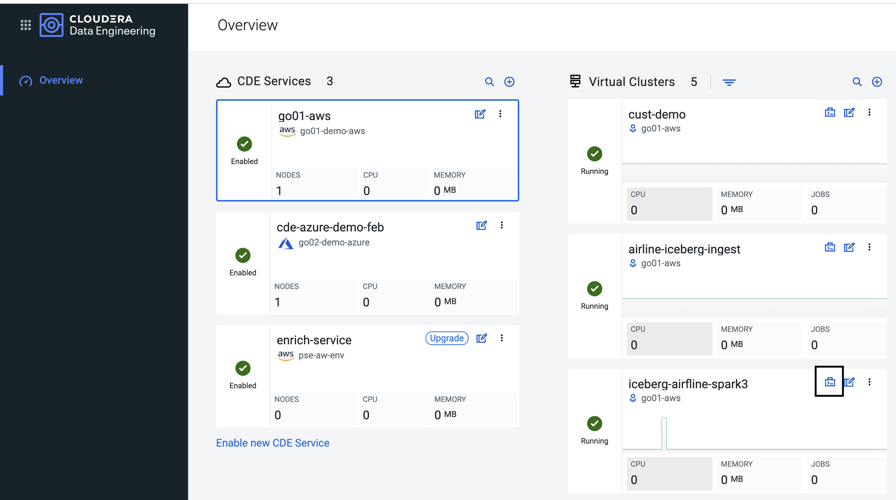
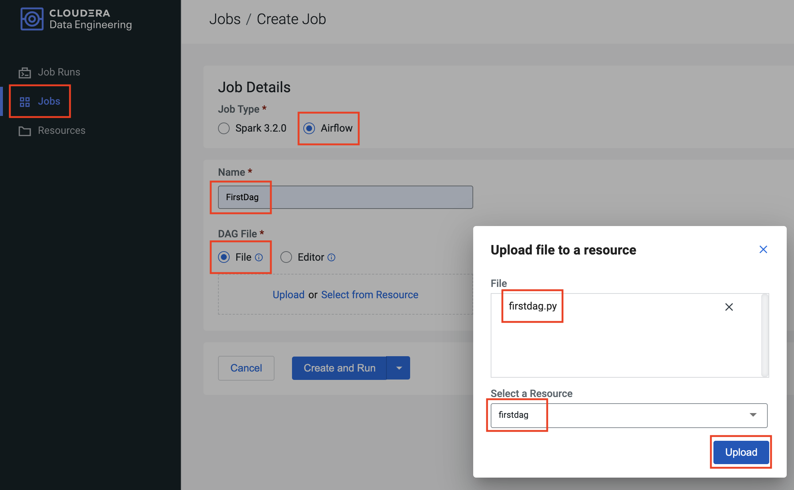
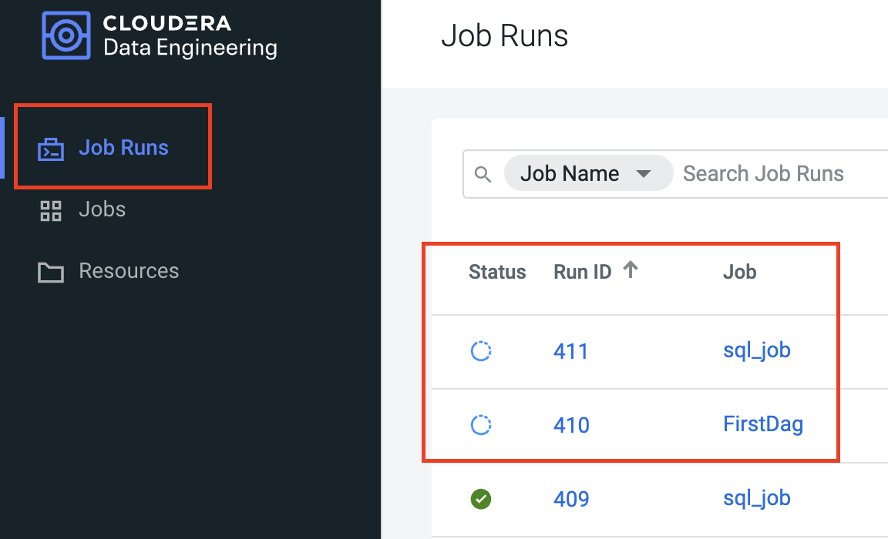
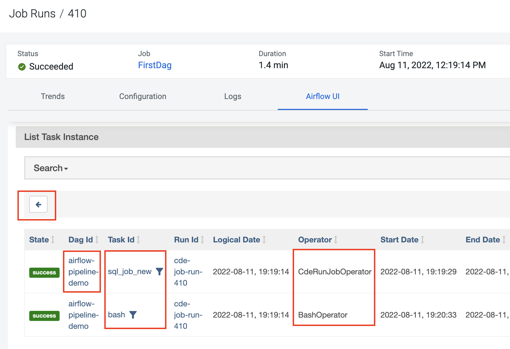
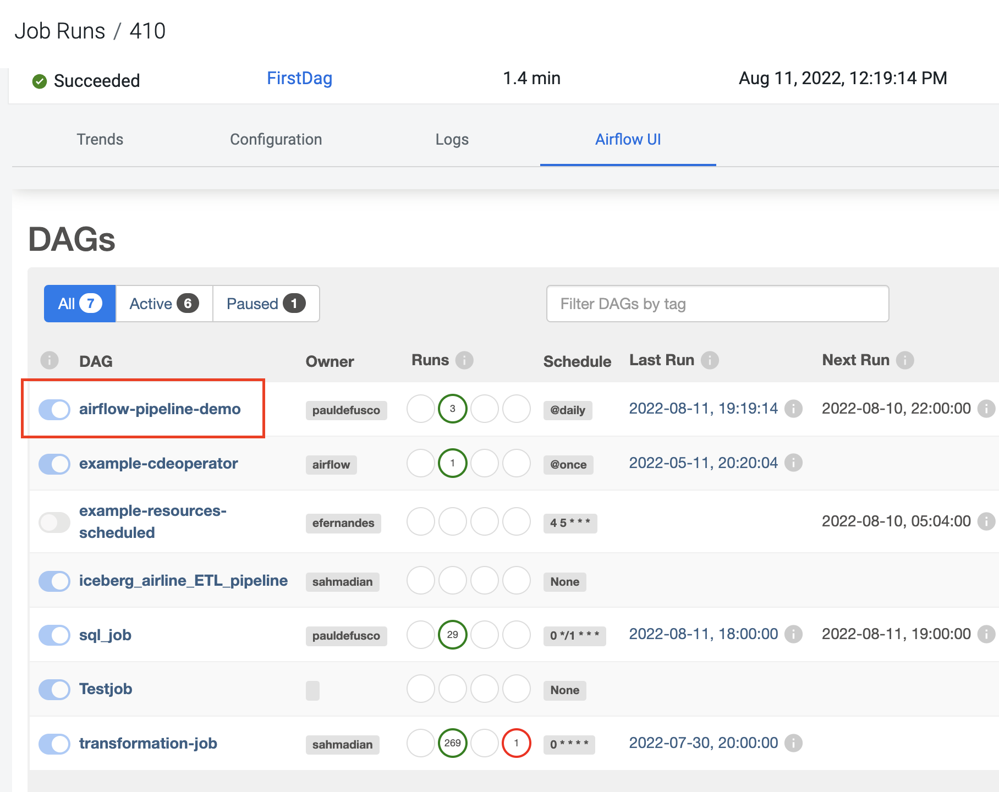
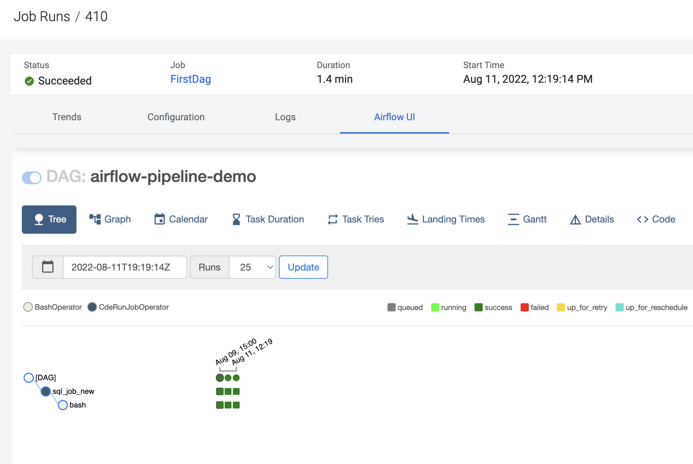
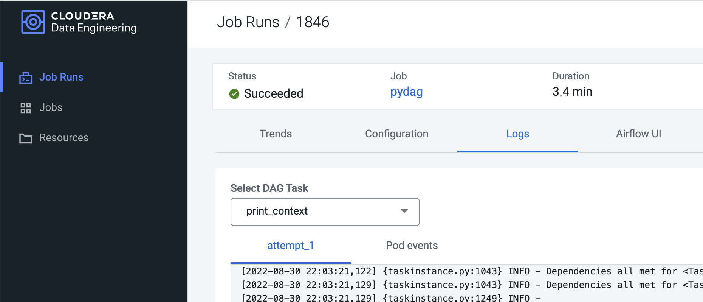
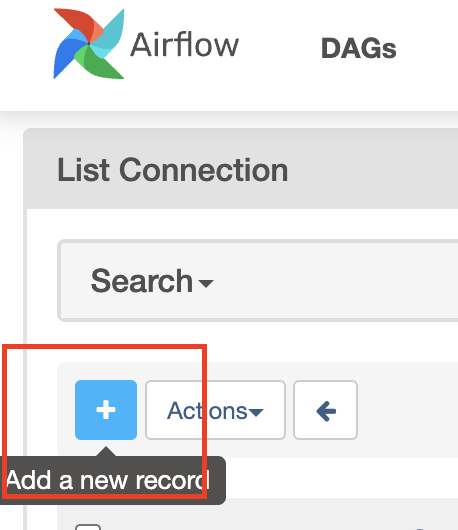
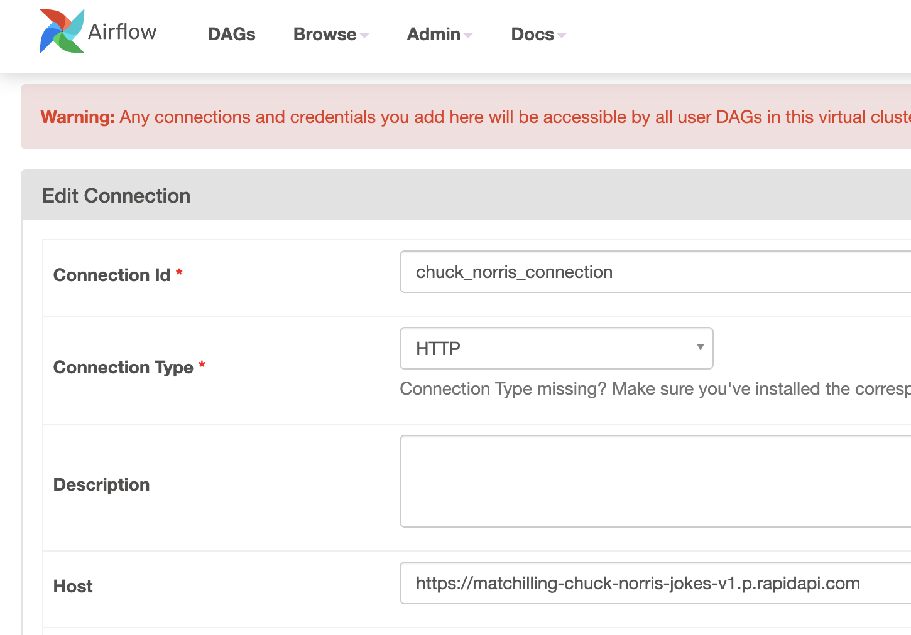

# Using CDE Airflow

## NB: This project is WIP 

## Objective

This tutorial provides a reference of Airflow features and capabilities in CDE, the Cloudera Data Enginereering Service available in CDP Public and Private Cloud. 

Apache Airflow is a platform to author, schedule and execute Data Engineering pipelines. It is widely used by the community to create dynamic and robust workflows for batch Data Engineering use cases. 

CDE embeds Apache Airflow at the CDE Virtual Cluster level. It is automatically deployed for the CDE user during CDE Virtual Cluster creation and requires no maintenance on the part of the CDE Admin.


## Requirements

In order to follow the steps you need:
* A CDE Virtual Cluster either in CDP Public or Private Cloud.
* Recommended: familiarity with the Python Programming Language.
* Recommended: knowledge of the CDE CLI. If this is new, you can complete [this introduction](https://github.com/pdefusco/CDE_CLI_Simple) or [this advanced guide](https://github.com/pdefusco/CDE_CLI_demo).
* Optional: a CDW Virtual Cluster. This will be required by the steps covering the Airflow CDW Operator to run Impala and Hive queries.


## Project Contents

1. Airflow Concepts
2. Getting Started with Airflow in CDE
3. Beyond Airflow for Spark Jobs
4. More Airflow DAG Features
5. Airflow Job Management with the CDE API and CLI
6. CDE Airflow FAQs


## 1. Airflow Concepts

#### The Airflow DAG

In Airflow, a DAG (Directed Acyclic Graph) is defined in a Python script, which represents the DAGs structure (tasks and their dependencies) as code.

For example, a simple DAG could consist of three tasks: A, B, and C. It could say that A has to run successfully before B can run, but C can run anytime. It could say that task A times out after 5 minutes, and B can be restarted up to 5 times in case it fails. It might also say that the workflow will run every night at 10pm, but shouldn’t start until a certain date.

For more information about Airflow DAGs reference the [Apache Airflow documentation](https://airflow.apache.org/docs/apache-airflow/stable/concepts/dags.html). 
For an example DAG in CDE reference the [CDE Cloudera documentation](https://docs.cloudera.com/data-engineering/cloud/orchestrate-workflows/topics/cde-airflow-editor.html).

#### The Airflow UI

The Airflow UI makes it easy to monitor and troubleshoot your data pipelines. For a complete overview of the Airflow UI reference the [Apache Airflow documentation](https://airflow.apache.org/docs/apache-airflow/stable/ui.html).
 
#### What is an Airflow CDE Job?

CDE Jobs can be of two types: Spark and Airflow. Airflow CDE Jobs are typically used to orchestrate Spark CDE Jobs as well as other Data Engineering actions. 

CDE Jobs of type Airflow consist primarily of an Airflow DAGs contained in a Python file. More on DAGs below.

There are three ways to build an Airflow CDE Job:

* Using the CDE Web interface. For more information, see [Running Jobs in Cloudera Data Engineering](https://docs.cloudera.com/data-engineering/cloud/manage-jobs/topics/cde-run-job.html).
* Using the CDE CLI tool. For more information, see Using the [Cloudera Data Engineering command line interface](https://docs.cloudera.com/data-engineering/cloud/cli-access/topics/cde-cli.html).
* Using CDE Rest API endpoints. For more information, see [CDE API Jobs](https://docs.cloudera.com/data-engineering/cloud/jobs-rest-api-reference/index.html)

In addition, you can automate migrations from Oozie on CDP Public Cloud Data Hub, CDP Private Cloud Base, CDH and HDP to Spark and Airflow CDE Jobs with the [oozie2cde API](https://github.com/pdefusco/Oozie2CDE_Migration). 

#### Open Source vs CDE Airflow

CDE packages the open source version of Airflow. Airflow is maintained and upgraded at each CDE version update. For example, the version of CDE 1.16 includes Airflow 2.2.5. 

CDE Airflow imposes no limitations on Operators, Plugins or other integrations with external platforms. Users are free to deploy Airflow DAGs in CDE as dictated by the use case. However, Cloudera contributed two operators to the Airflow Community: 

* CDE Operator: used to orchestrate Spark CDE Jobs. This has no requirements other than creating a Spark CDE Job separately and then referencing it within the Airflow DAG syntax.
* CDW Operator: used to orchestrate CDW Hive or Impala queries. This requires a Cloudera Virtual Warehouse and setting up an Airflow connection to it. 

For an example DAG in CDE using the two operators reference the [CDE Cloudera documentation](https://docs.cloudera.com/data-engineering/cloud/orchestrate-workflows/topics/cde-airflow-editor.html).


## 2. Getting Started with Airflow in CDE

#### Accessing the CDE Airflow UI

From your Virtual Cluster Service Details page, open the Airflow UI by clicking on the related icon as shown below.


#### Building Your Fist CDE Airflow DAG

We will start with a simple Airflow DAG that executes a Spark CDE Job and a shell command. 

We will work with the following artifacts:
* A python file containing Airflow DAG. This is provided under cde_jobs/firstdag.py.
* A pythong file containing a PySpark job. This is provided under cde_jobs/sql.py.

##### Step 1: Create a Spark CDE Job

Navigate to the CDE Virtual Cluster page. 



Open the Jobs UI and click on "Create Job" on the right side.   


Now fill out the form. Pick "sql.py" as your spark job file. Then, you will be prompted to select a resource. Create a new one with name "firstdag".

Resources are repositories inside the Virtual Cluster where you can store files, dependencies, and manage python environments.

For more info on resources, please visit the [CDE Documentation](https://docs.cloudera.com/data-engineering/cloud/overview/topics/cde-resources.html).


At the bottom of the form, make sure to select "Create" rather than "Create and Run" by clicking on the down arrow first. 


The Spark CDE Job is now available in the Jobs UI. 


##### Step 2: Review & Edit the Airflow DAG

In your editor, open the "firstdag.py" file located in the cde_jobs folder.


Let's go over the code. Between lines 2 and 7 we import the Python modules needed for the DAG.
Notice that at line 6 and 7 we import the CDEJobRunOperator and BashOperator. 
The CDEJobRunOperator was created by Cloudera to support Spark CDE Job.
The BashOperator is used to perform shell actions inside an Airflow DAG. 

```
from datetime import datetime, timedelta
from dateutil import parser
import pendulum
from airflow import DAG
from cloudera.cdp.airflow.operators.cde_operator import CDEJobRunOperator
from airflow.operators.bash import BashOperator
```

Between lines 8 and 22 we declare the DAG and its arguments. 

The arguments dictionary includes options for scheduling, setting dependencies, and general execution.
For a comprehensive list of DAG arguments please consult [this page](https://airflow.apache.org/docs/apache-airflow/stable/tutorial.html#default-arguments) in the documentation.

Once the arguments dictionary is complete it is passed as an argument to the DAG object instance.

```
default_args = {
        'owner': 'yourCDPusername',
        'retry_delay': timedelta(seconds=5),
        'depends_on_past': False,
        'start_date': pendulum.datetime(2020, 1, 1, tz="Europe/Amsterdam")
        }

firstdag = DAG(
        'airflow-pipeline-demo',
        default_args=default_args,
        schedule_interval='@daily',
        catchup=False,
        is_paused_upon_creation=False
        )
```

Between lines 24 and 28 an instance of the CDEJobRunOperator obect is declared with the following arguments:

* Task ID: This is the name used by the Airflow UI to recognize the node in the DAG.
* DAG: This has to be the name of the DAG object instance declared at line 16.
* Job Name: This has to be the name of the Spark CDE Job created in step 1 above. 

```
spark_step = CDEJobRunOperator(
        task_id='spark_sql_job',
        dag=firstdag,
        job_name='sql_job'
        )
```

Between lines 30 and 34 we declare an instance of the BashOperator object with the following arguments:

* Task ID: as above, you can pick an arbitraty string value
* DAG: This has to be the name of the DAG object instance declared at line 16.
* Bash Command: the actual shell commands you want to execute. 

Notice that this is just a simple example. You can optionally add more complex syntax with Jinja templating, use DAG variables, or even trigger shell scripts. 
For more please visit the [Airflow Bash Operator documentation](https://airflow.apache.org/docs/apache-airflow/stable/howto/operator/bash.html).

```
shell = BashOperator(
        task_id='bash',
        dag=firstdag,
        bash_command='echo "Hello Airflow" '
        )
```

Finally, at line 36 we declare Task Dependencies. With this statement you can specify the execution sequence of DAG tasks.

```
spark_step >> shell 
```

*Before moving on, make sure to open the DAG python file in your editor and replace the current value of the 'Owner' with your CDP Username in the default arguments dictionary.
No other changes are required at this time.*


#### Step 3: Running Your First CDE Airflow DAG

Navigate back to the CDE Jobs page and create a new CDE Job. Make sure to pick the following settings:


* Type: Airflow
* Name: FirstDag
* Dag File: Select type "File" and then upload "firstdag.py" to the firstdag CDE Resource you created earlier.

Select "Create and Run" to trigger the job immediately.





Navigate to the CDE Job Runs page and notice two CDE Jobs are now in progress. 
One of them is "sql_job" (Spark CDE Job) and the other is "FirstDag" (Airflow CDE Job).
The former has been triggered by the execution of the latter.
Wait a few moments and allow for the DAG to complete.



Next, click on the "FirstDag" link shown in the above screenshot to access the Job Run page. 
This page shows each run along with associated logs, execution statistics, and the Airflow UI. 

Ensure to select the most recent Run (in the below screenshot number 410) and then click on the Airflow UI tab.


The first landing page lists all tasks along with their status. 
Notice that the DAG ID, Task ID and Operator columns are populated with the values set in the DAG python files.
Next, click on the back arrow on the left side of the screen to navigate to the Airflow UI DAGs view. 



From the DAGs view you can:

* Pause/unpause a DAG
* Filter the list of DAGs to show active, paused, or all DAGs
* Trigger, refresh, or delete a DAG 
* Navigate quickly to other DAG-specific pages

Identify the DAG by the name you specified in the python file during DAG declaration. Click on it to open the Airflow UI DAG view to drill down with DAG-specific pages. 



Here, Airflow provides a number of tabs to increase job observability. Below is a brief explanation of the most important once.



##### The Tree View

The Tree View tracks DAG tasks across time. Each column represents a DAG Run and each square is a task instance in that DAG Run. 
Task instances are color-coded depending on success of failure. 
DAG Runs with a black border represent scheduled runs while DAG Runs with no border are manually triggered.

##### The Graph View

The Graph View shows a simpler diagram of DAG tasks and their dependencies for the selected run.
You can enable auto-refresh the view to see the status of the tasks update in real time.

##### The Calendar View

The Calendar View shows the state of DAG Runs overlaid on a calendar.

##### The Code View

The Code View shows the code that is used to generate the DAG. This is the DAG python file we used earlier.


## 3. Beyond Airflow for Spark Jobs

#### Using the CDWRunOperator 

The CDWRunOperator was contributed by Cloudera in order to orchestrate CDW queries with Airflow. 

##### CDW Setup Steps

Before we can use it in the DAG we need to connect Airflow to CDW. To complete these steps, you must have access to a CDW virtual warehouse. 
CDE currently supports CDW operations for ETL workloads in Apache Hive virtual warehouses. To determine the CDW hostname to use for the connection:

1. Navigate to the Cloudera Data Warehouse Overview page by clicking the Data Warehouse tile in the Cloudera Data Platform (CDP) management console.

2. In the Virtual Warehouses column, find the warehouse you want to connect to.

3. Click the three-dot menu for the selected warehouse, and then click Copy JDBC URL.

4. Paste the URL into a text editor, and make note of the hostname. For example, the hostname portion of the following JDBC URL is emphasized in italics:

```
jdbc:hive2://*hs2-aws-2-hive.env-k5ip0r.dw.ylcu-atmi.cloudera.site*/default;transportMode=http;httpPath=cliservice;ssl=true;retries=3;
```

##### CDE Setup Steps

1. Navigate to the Cloudera Data Engineering Overview page by clicking the Data Engineering tile in the Cloudera Data Platform (CDP) management console.

2. In the CDE Services column, select the service containing the virtual cluster you are using, and then in the Virtual Clusters column, click  Cluster Details for the virtual cluster.

3. Click AIRFLOW UI.

4. From the Airflow UI, click the Connection link from the Admin menu.

5. Click the plus sign to add a new record, and then fill in the fields:

* Conn Id: Create a unique connection identifier, such as cdw-hive-demo.
* Conn Type: Select Hive Client Wrapper.
* Host: Enter the hostname from the JDBC connection URL. Do not enter the full JDBC URL.
* Schema: default
* Login: Enter your workload username and password.

6. Click Save.


##### Editing the DAG Python file

Now you are ready to use the CDWOperator in your Airflow DAG. In your editor make a copy of "firstdag.py" and name it "cdw_dag.py"

At the top, import the Operator along with other import statements:

```
from cloudera.cdp.airflow.operators.cdw_operator import CDWOperator
```

At the bottom of the file add an instance of the CDWOperator object.

```
cdw_query = """
show databases;
"""

dw_step3 = CDWOperator(
    task_id='dataset-etl-cdw',
    dag=example_dag,
    cli_conn_id='cdw_connection',
    hql=cdw_query,
    schema='default',
    use_proxy_user=False,
    query_isolation=True
)
```

Notice that the SQL syntax run in the CDW Virtual Warehouse is declared as a separate variable and then passed to the Operator instance as an argument. 

Finally, update task dependencies to include "dw_step3":

```
spark_step >> shell >> dw_step3
```

DAG names are stored in Airflow and must be unique. Therefore, change the variable name of the DAG object instance to "airflow_cdw_dag" and the DAG ID to "dw_dag" as shown below.

```
airflow_cdw_dag = DAG(
        'dw_dag',
        default_args=default_args,
        schedule_interval='@daily',
        catchup=False,
        is_paused_upon_creation=False
        )
```

Notice the new DAG variable needs to be updated in each Operator as well. The completed DAG file is included in the cde_jobs folder for your convenience.

Next, create a new Airflow CDE Job named "CDW Dag". Upload the new DAG file to the same or a new CDE resource as part of the creation process.


Navigate to the CDE Job Runs Page and open the run's Airflow UI. Then open the Tree View and validate that the job has succeeded.


#### Printing Context Variables with the BashOperator

When Airflow runs a task, it collects several variables and passes these to the context argument on the execute() method. 
These variables hold information about the current task. 

Open the "bash_dag.py" file and examine the contents. Notice that at lines 52-56 a new instance of the BashOperator has been declared with the following entries:

```

also_run_this = BashOperator(
    task_id='also_run_this',
    dag=bash_airflow_dag,
    bash_command='echo "yesterday={{ yesterday_ds }} | today={{ ds }}| tomorrow={{ tomorrow_ds }}"',
)

```

Above we printed the "yesterday_ds", "ds" and tomorrow_ds" dates. There are many more and you can find the full list [here](https://airflow.apache.org/docs/apache-airflow/stable/macros-ref.html#default-variables) 

Variables can also be saved and reused by other operators. We will explore this in the section on XComs in section 4. 


#### Using the Python Operator

The PythonOperator allows you to run Python code inside the DAG. 
This is particularly helpful as it allows you to customize your DAG logic in a variety of ways. 

The PythonOperator requires implementing a callable inside the DAG file. Then, the method is called from the operator. 

Lines 60-67 in "py_dag.py" show how to use the operator to print out all Conext Variables in one run. 

```

def _print_context(**context):
   print(context)
 
print_context = PythonOperator(
    task_id="print_context",
    python_callable=_print_context,
    dag=dag,
)

```

Execute the DAG and once it completes open the run in the Job Runs page. Ensure to select the correct Airflow task which in this case is "print_context":



Scroll to the bottom and validate the output. 


## 4. More Airflow DAG Features


#### Using the SimpleHttpOperator

You can use the SimpleHttpOperator to call HTTP requests and get the response text back. 
The Operator can be a great fit when you need to interact with 3rd party systems, APIs, and perform actions based on complex control flow logic. 

In the following example we will send a request to the Chuck Norris API from the Airflow DAG. 
Before updating the DAG file, we need to set up a new Airflow Connection. 

1. Navigate to the CDE Virtual Cluster Service Details page and then open the Airflow UI. 
2. Open the Connections page under the Admin tab. 


3. Add a new connection



4. Configure the connection by entering the following values for the following parameters. Leave the remaining entries blank.

```

* Connection ID: chuck_norris_connection
* Connection Type: HTTP
* Host: https://matchilling-chuck-norris-jokes-v1.p.rapidapi.com/

```



5. Save the new connection and close the Airflow UI. 

Next, open "http_dag.py" and familiarize yourself with the code. The new operator is used between lines 71 and 89.
The "http_conn_id" parameter is mapped to the Connection ID you configured in the prior step. 
The "response_check" parameter allows you to specify a python method to validate responses. This is the "handle_response" method declared at line 71.   


```
def handle_response(response):
    if response.status_code == 200:
        print("Received 2000 Ok")
        return True
    else:
        print("Error")
        return False

http_task = SimpleHttpOperator(
    task_id="chuck_norris_task",
    method="GET",
    http_conn_id="chuck_norris_connection",
    endpoint="/jokes/random",
    headers={"Content-Type":"application/json",
            "X-RapidAPI-Key": "f16c49e390msh7e364a479e33b3dp10fff7jsn6bc84b000b75",
            "X-RapidAPI-Host": "matchilling-chuck-norris-jokes-v1.p.rapidapi.com"},
    response_check=lambda response: handle_response(response),
    dag=http_dag
)
```

As before, execute the DAG as a new CDE Job and validate results for the "http_task" under the Job Runs Logs tab.


#### Using XComs

Although the request in the prior step was successful the operator did not actually return the response. 
XComs (short for “cross-communications”) are a mechanism that let Tasks talk to each other, as by default Tasks are entirely isolated and may be running on entirely different machines.

Practically XComs allow your operators to store results into a governed data structure and then reuse the values within the context of different operators. 
An XCom is identified by a key (essentially its name), as well as the task_id and dag_id it came from. 
They are only designed for small amounts of data; do not use them to pass around large values, like dataframes.

 

#### Writing a Custom Opeator


## 5. Airflow Job Management with the CDE API and CLI

#### Using the CDE CLI for Airflow CDE Jobs

For Spark CDE Jobs, the CDE CLI provides an intuitive solution to create and manage Airflow CDE Jobs. 

The CDE CLI commands to create a resource and upload files to it are identical as in the Spark CDE Job section.

##### Submit Airflow CDE Job with local DAG file

```
cde airflow submit my-airflow-job.py
```

##### Create Airflow CDE Job

Notice that the --application-file flag has been replaced with the --dag-file flag. 

```
cde job create --name myairflowjob --type airflow --dag-file path/to/airflow_dag.py
```

#### Using the CDE API for Airflow CDE Jobs

As with the CDE CLI, this section builds on the prior examples on the CDE API with Spark CDE Jobs.

The payload now includes the argument “airflow” for the “type” parameter. For more details on building AIrflow CDE requests, refer to the Swagger API page.

```
curl -H "Authorization: Bearer $ACCESS_TOKEN" -X 'POST' \
'$JOBS_API_URL/jobs' \
-H 'accept: application/json' \
-H 'Content-Type: application/json' \
-d '{"type": "airflow", "airflow": {"dagFile": "my_dag.py"}, "identity": {"disableRoleProxy": true},"mounts": [{"dirPrefix": "/","resourceName": "oozie_migration"}],"name": "oozie2airflow_migration","retentionPolicy": "keep_indefinitely"}'
```

## CDE Airflow FAQs

1. Can you connect a CDE Airflow Instance to an Open Source instance outside of CDP/CDE?

Yes, if you have complex Airflow implementations and have a need to keep them running you can connect one to the other


2. Can airflow be used to orchestrate workloads on Private cloud base?

Yes, please visit this github for a demonstration (*coming soon*)


3. Can airflow be run as a standalone product?

Not as of CDE 1.16. This is on the CDE roadmap. 


4. Can I install some cloud native plugins into the version of airflow shipped by Cloudera?

You cannot install plugins in CDE Public Cloud however you can do so in CDE Private Cloud.


5. Can airflow be used to orchestrate workloads running outside CDP ?

Yes, this can be done in a number of ways and it really depends on the 3rd party system you want to connect to. 

Generally speaking, the HTTP Operator is the best way to connect via REST API. An example is provided above. 


Don't find your question here? Please reach out to your Cloudera Account Team or [submit your questions thorugh this form](https://www.cloudera.com/contact-sales.html).


## Conclusions & Next Steps

CDE is the Cloudera Data Engineering Service, a containerized managed service for Spark and Airflow. 
Top benefits of using CDE include:

* Ability to pick Spark versions
* Apache Airflow Scheduling
* Enhanced Observability with Tuning, Job Analysis and Troubleshooting interfaces.
* Job Management via a CLI and an API. 

If you are exploring CDE you may find the following tutorials relevant:

* [Spark 3 & Iceberg](https://github.com/pdefusco/Spark3_Iceberg_CML): a quick intro of Time Travel Capabilities with Spark 3

* [Simple Intro to the CDE CLI](https://github.com/pdefusco/CDE_CLI_Simple): A simple introduction to the CDE CLI for the 

* [CDE CLI Demo](https://github.com/pdefusco/CDE_CLI_demo): A more advanced CDE CLI reference with additional details for the CDE user who wants to move beyond the basics shown here. 

* [GitLab2CDE](https://github.com/pdefusco/Gitlab2CDE): a CI/CD pipeline to orchestrate Cross Cluster Workflows - Hybrid/Multicloud Data Engineering

* [CML2CDE](https://github.com/pdefusco/CML2CDE): a CI/CD Pipeline to deploy Spark ETL at Scale with Python and the CDE API

* [Postman2CDE](https://github.com/pdefusco/Oozie2CDE_Migration): using the Postman API to bootstrap CDE Services


